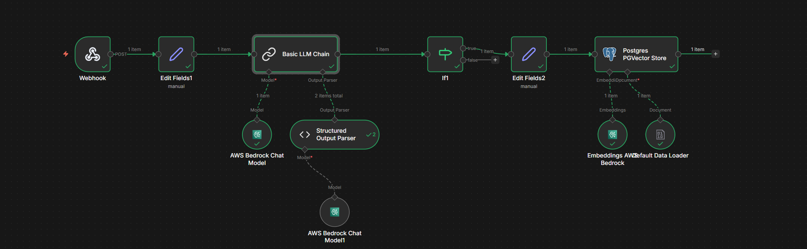
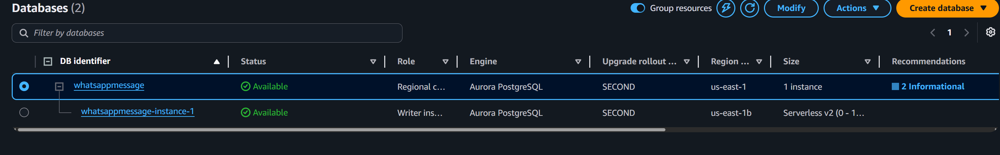

# WhatsApp Clearing (n8n ingestion)

Parse WhatsApp exported `.txt` files into **Q/A sessions** and optionally POST each session to an **n8n Webhook**.

This project is designed to prepare customer service chats for downstream processing (e.g. LLM-based summarization, FAQ extraction, vector DB ingestion).

## Features

- **Supports common WhatsApp export formats**
  - Android/Desktop: `DD/MM/YYYY, HH:MM - Name: message`
  - iOS / locale variants: `[DD/MM/YYYY, HH:MM:SS] Name: message`
  - Also supports `[DD/MM/YYYY HH:MM:SS]` (space / narrow NBSP `U+202F` / thin space `U+2009`)
- **Turn-based pairing (recommended)**: output sessions as:
  - `[{"sender":"Customer","message":"..."}, {"sender":"Agent","message":"..."}]`
- **Handles multi-line messages** (continuation lines are appended)
- **Group chat support (best-effort)** with `--preserve-customer-ids`
- **Webhook posting**: send each session to n8n
- **Writes a JSON file** for auditing/debugging

## Privacy & Security Notes

- Do **not** commit raw exports or generated outputs. They can contain names, phone numbers, addresses, and other PII.
- This repo includes a `.gitignore` that excludes typical input/output folders and files.
- The included n8n workflow JSON is **sanitized** (no credential objects, no real webhook paths).

## Setup

### Conda (recommended)

```powershell
conda create -y -n n8n-project python=3.12 pip
conda activate n8n-project
pip install requests
```

### Requirements

- Python 3.10+
- `requests` (only needed if you use `--webhook-url` / `N8N_WEBHOOK_URL`)

## Usage

### 1) Turn mode (Q/A pairs) – recommended

Provide your agent display names exactly as they appear in the export:

```powershell
python parse_whatsapp_folder.py `
  -i ".\exports" `
  -o ".\cleaned_conversations.json" `
  --split-mode turn `
  --agent-names "CHARGESPOT,My Support Team"
```

Optional group chat flags:

```powershell
python parse_whatsapp_folder.py -i ".\exports" -o ".\out.json" `
  --split-mode turn `
  --agent-names "CHARGESPOT" `
  --preserve-customer-ids `
  --group-strategy recent-customer
```

### 2) Time mode (fallback / exploration)

```powershell
python parse_whatsapp_folder.py -i ".\exports" -o ".\out.json" --split-mode time --hours-gap 24
```

### 3) Send to n8n Webhook

```powershell
python parse_whatsapp_folder.py -i ".\exports" -o ".\out.json" `
  --split-mode turn `
  --agent-names "CHARGESPOT" `
  --webhook-url "https://YOUR-N8N-DOMAIN/webhook/YOUR_ID"
```

Or set an environment variable instead of passing the URL:

```powershell
$env:N8N_WEBHOOK_URL="https://YOUR-N8N-DOMAIN/webhook/YOUR_ID"
python parse_whatsapp_folder.py -i ".\exports" -o ".\out.json" --split-mode turn --agent-names "CHARGESPOT"
```

### Webhook payload format

For each session, the script POSTs:

```json
{
  "session": [
    {"sender": "Customer", "message": "..."},
    {"sender": "Agent", "message": "..."}
  ],
  "source_file": "relative/path/to/chat.txt",
  "session_index": 0
}
```

## n8n workflow

The file `WhatsApp to Vector Database.json` is a **template** workflow export.

Below is a **screenshot of the workflow canvas** (Webhook POST → field edits → **Basic LLM Chain** with AWS Bedrock and structured output → **If** branch → further edits → **Postgres PGVector Store** with Bedrock embeddings):



Import it into n8n, then:

- Configure your **Webhook** node path
- Configure credentials for providers (e.g. AWS Bedrock, Postgres)

The **Postgres PGVector Store** node expects a reachable PostgreSQL database with the PGVector extension. As an **optional infrastructure reference**, the following screenshot shows an example **Amazon Aurora PostgreSQL** cluster in AWS RDS (cluster `whatsappmessage`, writer in `us-east-1` with Aurora Serverless v2 scaling):



## License

MIT 

